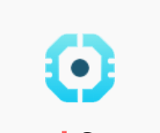
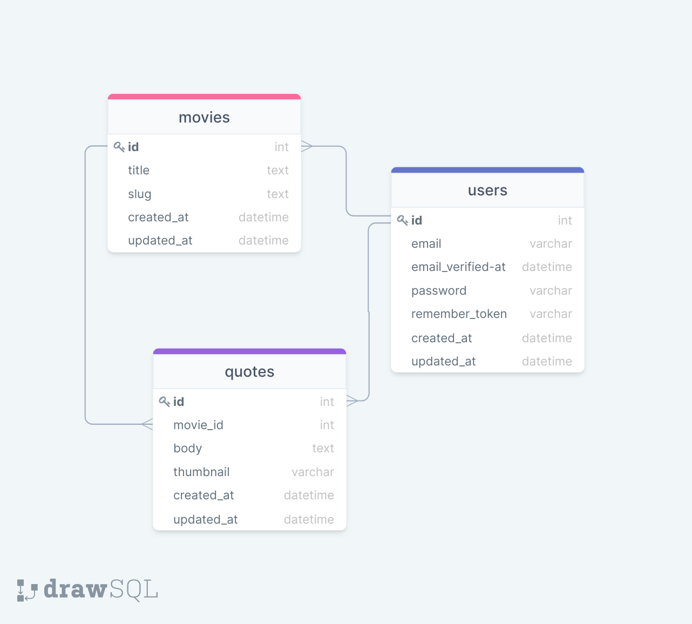

<div style="display:flex; align-items: center">
  
</div>

#
<h1>Movie Quotes API</h1>


Movie Quotes is a web application where you can find quotes from different movies and browse them randomly, also you can search for quotes from a specific movie. Here is the documentation of API part of the application.

## Table of Contents

* [Prerequisites](#req)
* [Tech Stack](#teck)
* [Getting Started](#gettingStarted)
* [Migrations](#migrations)
* [Resources](#resources)
* [Development](#development)
* [Deployment](#deployment)
* [Database Structure](#database)
* [Project Structure](#project)
* [Server Infrastructure](#server)
* [Recourses](#recourses)


#
<h2 id="req">Prerequisites:</h2>
<table>
    <tr>
        <td> </td>
        <td>PHP</td>
        <td>8.0.12</td>
    </tr>
    <tr>
        <td>  </td>
        <td>mysql</td>
        <td>---</td>
    </tr>
    <tr>
        <td></td>
        <td>npm</td>
        <td>6.14.15</td>
    </tr>
    <tr>
        <td> </td>
        <td>composer</td>
        <td>2.1.11</td>
    </tr>
</table>

#
<h2 id="teck">Tech Stack:</h2>
<table>
    <tr>
        <td></td>
        <td>Laravel</td>
        <td>8</td>
    </tr>
    <tr>
        <td></td>
        <td>Swagger</td>
        <td>---</td>
    </tr>
    <tr>
        <td> </td>
        <td>Laravel Mix</td>
        <td>6.0.43</td>
    </tr>
    <tr>
        <td> </td>
        <td>Spatie Laravel Translatable</td>
        <td>---</td>
    </tr>
    <tr>
        <td> </td>
        <td>laravel Sanctum for Authorization</td>
        <td>---</td>
    </tr>
</table>

#
<h2 id="gettingStarted">Getting Started</h2>

1\. First of all you need to clone repository from github:
```sh

git clone https://github.com/Tamar-Gagniashvili/movie-quotes-back.git
```

2\. Next step requires you to run *composer install* in order to install all the dependencies.
```sh
composer install
```

3\. after you have installed all the PHP dependencies, it's time to install all the JS dependencies:
```sh
npm install
```
and also:
```sh
npm run dev
```
in order to build your JS/SaaS resources.

4\. Now we need to set our env file. Go to the root of your project and execute this command.
```sh
cp .env.example .env
```

And now you should provide **.env** file all the necessary environment variables. All you need here is DB_CONNECTION :
```sh
DB_CONNECTION=mysql
DB_HOST=127.0.0.1
DB_PORT=3306
DB_DATABASE=********
DB_USERNAME=********
DB_PASSWORD=********
```
after setting up .env file, execute:
```sh
php artisan config:cache
```
in order to cache environment variables.

5\. Now execute in the root of you project following:
```sh
  php artisan key:generate
```
Which generates auth key.

6\. Also, you need to execute the command below, in order to show the movie thumbnails from the necessary folder:
```sh
  php artisan storage:link
```


#
<h2 id="migrations">Migration</h2>

After passing getting started section, migrating is a simple process, you just need to execute:
```sh
php artisan migrate
```

In order to be able to use the admin panel, you need to use the artisan command, that is writen below and follow the simple instructions, just provide your email and password:
```sh
php artisan create:admin
```

##### Now, you should be good to go!

#
<h2 id="development">Development</h2>
You can run Laravel's built-in development server by executing:

```sh
  php artisan serve
```
#
<h2 id="deployment">Deployment</h2>
In order to integrate production server you need to follow these deployment steps: <br/>
1. First you need to pull all changes you make in project on github. <br/>
2.then you need to go to your server and login with ssh command. <br/>
3.After goint to your server and pull changes with command *git pull* you need to execute couple of commands and you will be good to go:
```sh
>composer install
>npm install
>npm run prod
>php artisan optimize
>php artisan migrate
```

#
<h2 id="database">Database Structure</h2>

Projects has simple database structure. Here is the Database Diagram where you can see how the tables are connected and how it works:



### You can see the database truncture here ⇩:

[Database Design Diagram](https://drawsql.app/redberry-6/diagrams/movie-quotes)

#
<h2 id="project">Project Structure</h2>

```bash
├─── .vscode
│   ├─── settings.json
├─── app
│   ├─── Console
│   ├─── Exceptions
│   ├─── Http
│   ├───Models
│   ├─── Providers
├─── bootstrap
├─── config
├─── database
├─── node_modules
├─── public
├─── assets
│   ├─── readme
├─── resources
├─── routes
├─── storage
├─── tests
├─── vendor
- .env
- artisan
- composer.json
- .php-cs-fixer.php
- package.json
- phpunit.xml
- tailwind.config.js
- webpack.mix.js
```
Project structure is fairly straitforward(at least for laravel developers)...

For more information about project standards, take a look at these docs:
* [Laravel](https://laravel.com/docs/6.x)

#
<h2 id="server">Server Infrastructure</h2>

##### Development Server
For development server we are using **mysql**

##### Production Server
For production server we are using **sqlite** 


#
<h2 id="recourses">Recourses</h2>
You can see the recourses, that helped me install my projects dependences and some packages:

* [Setting up Production Server](https://redberry.gitbook.io/resources/laravelis-proektis-serverze-gamartva)
* [Swagger](https://redberry.gitbook.io/resources/api-is-dokumentatsia-swagger-is-integratsia-laravel-shi)
* [SQLite](https://medium.com/@giorgi.official/sqlite-%E1%83%98%E1%83%A1-%E1%83%92%E1%83%90%E1%83%9B%E1%83%90%E1%83%A0%E1%83%97%E1%83%95%E1%83%90-laravel-%E1%83%98%E1%83%A1-%E1%83%90%E1%83%9E%E1%83%9A%E1%83%98%E1%83%99%E1%83%90%E1%83%AA%E1%83%98%E1%83%90%E1%83%A8%E1%83%98-591b419aae20)
* [Tailwind](https://tailwindcss.com/docs/installation)
* [Spatie/Laravel Translatable](https://github.com/spatie/laravel-translatable)
* [PHP-cs fixer](https://medium.com/@giorgi.official/php-%E1%83%98%E1%83%A1-%E1%83%9A%E1%83%98%E1%83%9C%E1%83%A2%E1%83%94%E1%83%A0%E1%83%98-bc630365be60)
* [PHP-8](https://medium.com/@giorgi.official/php8-%E1%83%98%E1%83%A1-%E1%83%92%E1%83%90%E1%83%9B%E1%83%90%E1%83%A0%E1%83%97%E1%83%95%E1%83%90-ubuntu-%E1%83%A1-%E1%83%9D%E1%83%9E%E1%83%94%E1%83%A0%E1%83%90%E1%83%AA%E1%83%98%E1%83%A3%E1%83%9A-%E1%83%A1%E1%83%98%E1%83%A1%E1%83%A2%E1%83%94%E1%83%9B%E1%83%90%E1%83%96%E1%83%94-2f816ddb93fb)

